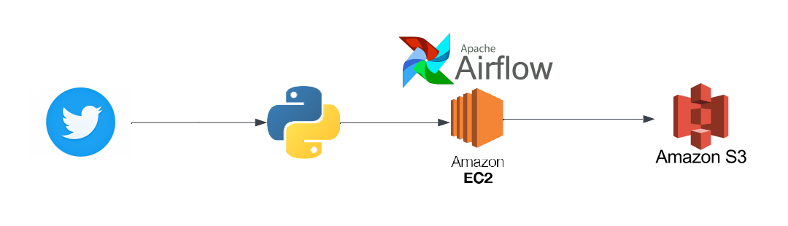

# nidhi-twitter-airflow-data-engineering-project
This repo consists of all the code that pulls data from twitter, schedules script on airflow via EC2 and pushes data to s3 bucket. The code written, specifically pulls `elonmusk` tweets, creates a dataframe and finally pushes the csv to s3 bucket via airflow scheduling.

## Steps Involved

* Create a Twitter Developer account
* Extract the api keys or bearer token based on which twitter api are you using
* Write a python script to extract required data from tweepy api
* Write a python dag script to run the file on airflow 
* Create AWS EC2 Intance 
* Connect to AWS EC2 instance via SSH from Terminal 
* Install required python and twitter packages on the instance
* Install apache airflow 
* Run Apache airflow on port 8080
* Create s3 bucket to push the final file that was created
* Move all local files on EC2 instance using `scp` command 
* Run the dag that was created on airflow and fix if there are any errors. 
* Final result: you should be able to see the file with all the required data on s3 bucket

## Architecture Diagram 

## Challenges
* Twitter API 
* EC2 Instance free tier 
* Security block while accessing the Airflow